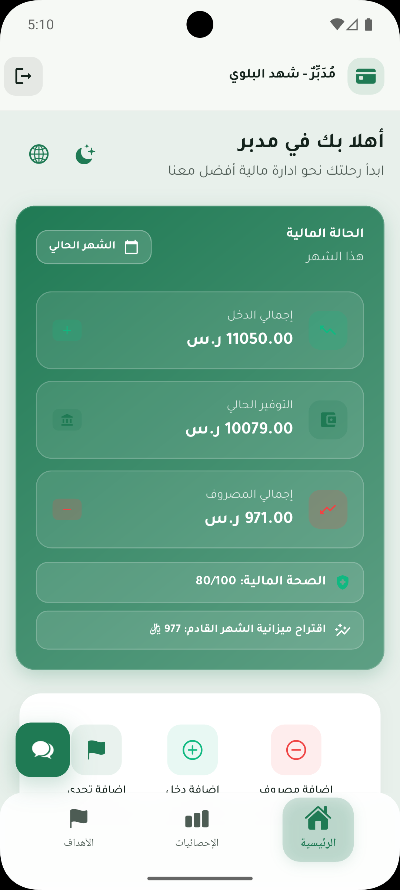
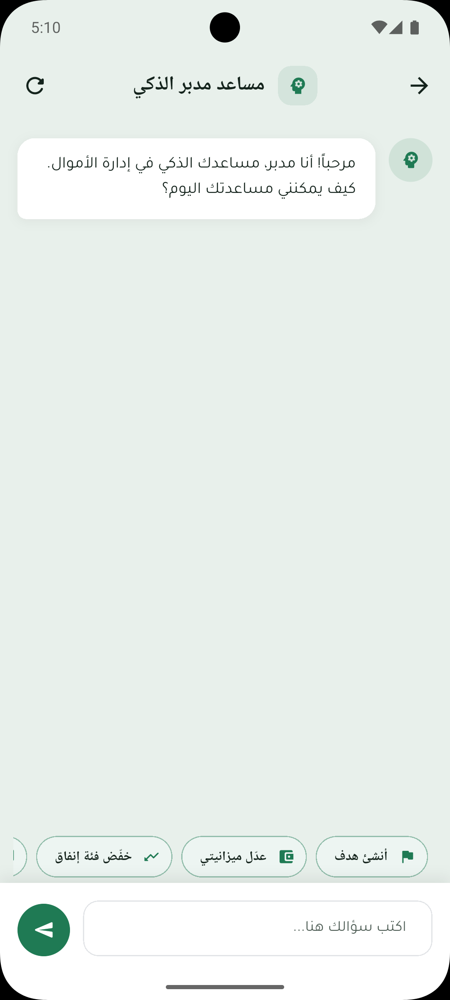
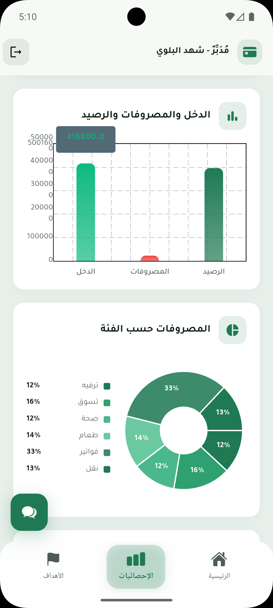
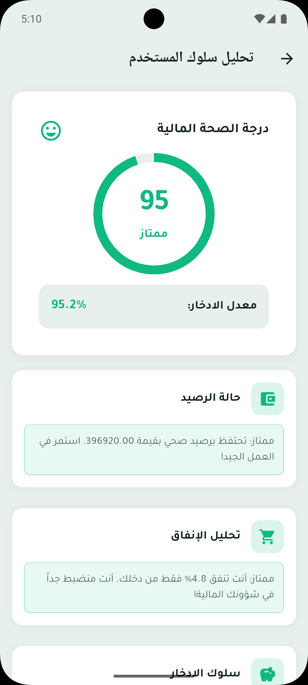
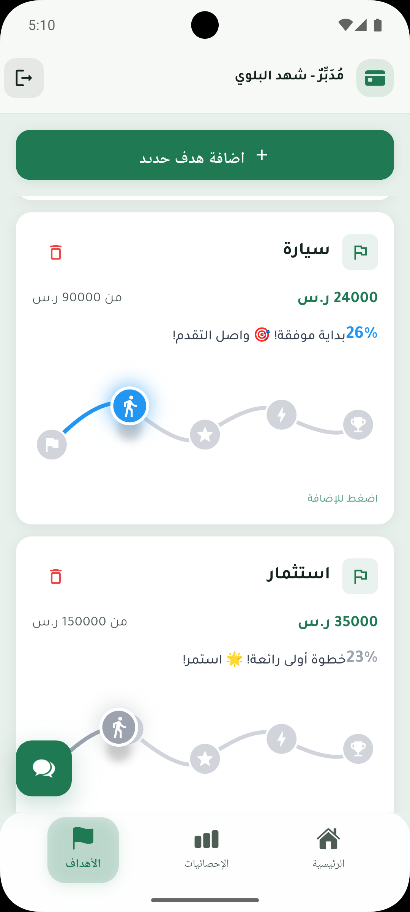

<<<<<<< HEAD
# Mudabbir — مُدَبِّر

تطبيق مالية شخصية: **Flutter** + **Laravel**. واجهة عربية أساساً (ميزانية، أهداف، تحديات، إحصائيات، شات ذكي).

| المجلد | الوظيفة |
|--------|---------|
| **`frontend/`** | تطبيق Flutter — التشغيل والإعداد: `frontend/README.md` |
| **`backend/`** | واجهة Laravel REST — التشغيل: `backend/README.md` |
| **`docs/`** | نشر Render وغيره (اختياري) |
| **`.devcontainer/`** | Cursor / VS Code: فتح المشروع داخل حاوية PHP + Composer (يتطلب Docker Desktop) |
| **`scripts/run-backend-docker.ps1`** | تشغيل الباكند بـ Docker من PowerShell بدون PHP محلي |

---

## كيفية الاستخدام (ملخص)

### 1) التطبيق (Flutter)

```bash
cd frontend
flutter pub get
flutter run
```

تفاصيل التعريفات (`API_BASE_URL`، `USE_LOCAL_API`، وضيف التجربة): راجع **`frontend/README.md`**.

### 2) الـ API (Laravel)

```bash
cd backend
composer install
copy .env.example .env
php artisan key:generate
```

أنشئ ملف SQLite ثم الهجرات (راجع **`backend/README.md`**). إذا **PHP غير متوفر** على Windows: استخدم **Docker** أو **`.devcontainer`** أو السكربت **`scripts/run-backend-docker.ps1`**.

---

## Tech stack

Flutter / Dart · Laravel / PHP · SQLite · REST
=======
# Mudabbir | Graduation Project

Mudabbir is a cross-platform mobile application for personal finance management. It provides actionable insights to track expenses, monitor savings goals, and improve financial habits efficiently. The application transforms raw financial data into structured, meaningful guidance to support smarter financial decisions.

The system integrates intelligent analytics and an AI-powered chatbot to deliver personalized financial assistance in both Arabic and English.

---

## Overview

Mudabbir enables users to gain full visibility over their financial behavior through intuitive dashboards, behavioral analysis, and real-time insights. It combines tracking, analytics, and AI interaction into a unified experience.

---

## Key Features

- Expense tracking and categorization  
- Savings goals management and progress tracking  
- AI-powered chatbot for financial guidance (Arabic & English)  
- Behavioral analysis of spending patterns  
- Social challenges to encourage saving habits  
- Interactive dashboards for financial insights  

---

## Screenshots

### Home Screen


### AI Chatbot


### Analytics Dashboard


### Behavioral Analysis


### Goals Tracking


---

## Key Contributions

- Developed a cross-platform mobile application using Flutter and Dart  
- Built an AI-powered chatbot for financial guidance in Arabic and English  
- Implemented behavioral analysis models for spending insights  
- Integrated backend services using Laravel and SQLite  
- Managed full development lifecycle including UI/UX design, development, and testing  

---

## Technology Stack

- Flutter (Frontend)  
- Dart  
- Laravel (Backend)  
- PHP, SQLite  
- REST APIs  
- Git & GitHub  

---

## Vision

Mudabbir aims to empower individuals to take control of their financial future by providing intelligent, accessible, and user-friendly financial tools.

---

## Future Work

- Advanced AI-driven financial recommendations  
- Banking API integration  
- Enhanced data visualization dashboards  
- Personalized financial planning system  
>>>>>>> 7bbb868ac37828e770d46d0d8b8076a85fbfaad6
