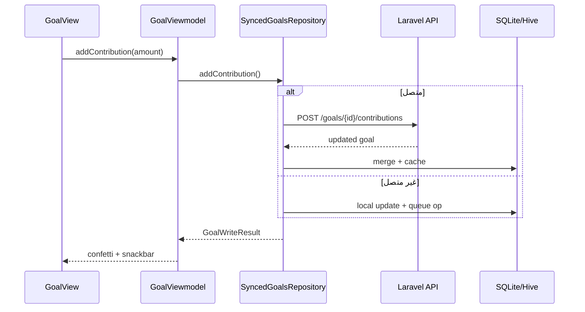
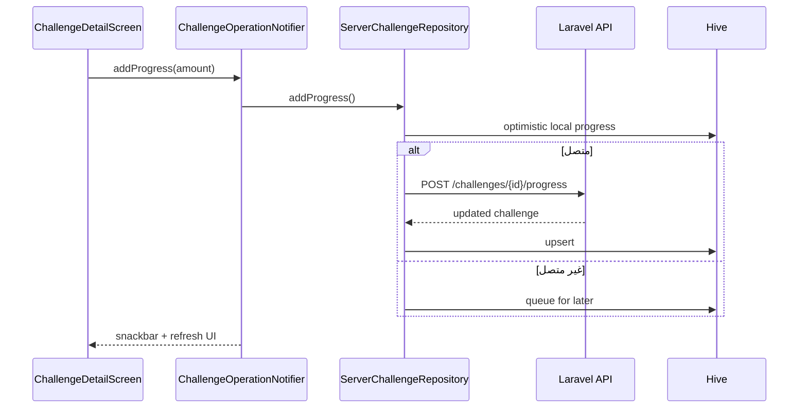

# مراجعة شاملة — Mudabbir (الأهداف والتحديات)

> **التاريخ:** يونيو 2026  
> **النطاق:** مراجعة كاملة للمشروع مع تركيز تفصيلي على صفحات **الأهداف (Goals)** و**التحديات (Challenges)**  
> **الإصدار:** 1.0.0+1

---

## جدول المحتويات

1. [ملخص تنفيذي](#1-ملخص-تنفيذي)
2. [نظرة عامة على المشروع](#2-نظرة-عامة-على-المشروع)
3. [صفحة الأهداف (Goals)](#3-صفحة-الأهداف-goals)
4. [صفحة التحديات (Challenges)](#4-صفحة-التحديات-challenges)
5. [مقارنة الأهداف والتحديات](#5-مقارنة-الأهداف-والتحديات)
6. [واجهة برمجة التطبيقات (API)](#6-واجهة-برمجة-التطبيقات-api)
7. [التخزين والمزامنة](#7-التخزين-والمزامنة)
8. [تجربة المستخدم والتصميم](#8-تجربة-المستخدم-والتصميم)
9. [الاختبارات](#9-الاختبارات)
10. [نقاط القوة](#10-نقاط-القوة)
11. [الفجوات والمخاطر](#11-الفجوات-والمخاطر)
12. [توصيات التحسين](#12-توصيات-التحسين)
13. [تقييم عام](#13-تقييم-عام)

---

## 1. ملخص تنفيذي

**Mudabbir (مُدَبِّر)** تطبيق إدارة مالية شخصية ثنائي اللغة (عربي/إنجليزي) مبني كـ Monorepo: عميل **Flutter** وخادم **Laravel API**. يتبع فلسفة **Offline-First** للمصروفات والأهداف، مع ميزات اجتماعية في التحديات.

| المعيار | الأهداف | التحديات | المشروع ككل |
|---------|---------|----------|-------------|
| **اكتمال الواجهة** | ⭐⭐⭐⭐⭐ | ⭐⭐⭐⭐⭐ | ⭐⭐⭐⭐ |
| **Offline-First** | ⭐⭐⭐⭐⭐ | ⭐⭐⭐ | ⭐⭐⭐⭐ |
| **تغطية API** | ⭐⭐⭐⭐ | ⭐⭐⭐⭐⭐ | ⭐⭐⭐⭐ |
| **الاختبارات** | ⭐⭐⭐⭐ | ⭐⭐⭐⭐ | ⭐⭐⭐⭐ |
| **Gamification** | ⭐⭐⭐⭐ | ⭐⭐⭐⭐⭐ | ⭐⭐⭐⭐ |

**الخلاصة:** صفحتا الأهداف والتحديات من أكثر الأقسام نضجاً في التطبيق. الأهداف أقوى في المزامنة المحلية؛ التحديات أغنى في التفاعل الاجتماعي (دعوات، لوحة متصدرين، سلاسل يومية).

---

## 2. نظرة عامة على المشروع

### 2.1 الهيكل

```
Mudabbir.app-main/
├── frontend/     # Flutter — العميل
├── backend/      # Laravel — REST API
├── docs/         # الوثائق
└── scripts/      # سكربتات البناء والتشغيل
```

### 2.2 الميزات الرئيسية

| الميزة | الوصف |
|--------|-------|
| الرئيسية | الرصيد، الميزانية، إجراءات سريعة |
| المصروفات | إضافة/تعديل/حذف مع مزامنة |
| الميزانية | حدود شهرية وتنبيهات |
| **الأهداف** | ادخار شخصي مع تتبع التقدم |
| **التحديات** | ادخار اجتماعي مع منافسة |
| الإحصائيات | رسوم بيانية ومؤشرات KPI |
| المساعد الذكي | محادثة مالية عبر OpenAI/Gemini |
| التقارير | PDF شهري |
| الإشعارات | محلية + FCM (هيكل جاهز) |

### 2.3 التقنيات

| الطبقة | التقنية |
|--------|---------|
| العميل | Flutter 3.x, Riverpod, GetIt, GoRouter, Hive, SQLite |
| الخادم | Laravel, Sanctum, JSON File Store |
| الذكاء الاصطناعي | OpenAI / Gemini (SSE streaming) |
| النشر | Render, Docker |

### 2.4 التنقل (Navigation)

الأهداف والتحديات تظهران كتبويبين داخل `HomePage`:

```dart
// frontend/lib/presentation/home/home_viewmodel.dart
GoalView(),
ChallengesListScreen(embedded: true),
```

التحديات لها أيضاً مسارات مستقلة عبر `GoRouter`:

| المسار | الشاشة |
|--------|--------|
| `/challenges` | قائمة التحديات |
| `/challenges/create` | إنشاء تحدي |
| `/challenges/invitations` | الدعوات المعلقة |
| `/challenges/:id` | تفاصيل التحدي |

---

## 3. صفحة الأهداف (Goals)

### 3.1 الغرض

تمكين المستخدم من تحديد **أهداف ادخار شخصية** (سيارة، طوارئ، سفر…) ومتابعة التقدم عبر مساهمات يدوية، مع توقعات زمنية وحالات تتبع ذكية.

### 3.2 هيكل الملفات

| الطبقة | الملفات الرئيسية |
|--------|------------------|
| **الواجهة** | `goals_view.dart`, `goals_viewmodel.dart`, `goal_popup.dart` |
| **النماذج** | `savings_goal.dart`, `goal_progress_engine.dart` |
| **المستودع** | `synced_goals_repository.dart`, `goals_repository.dart` |
| **البيانات** | `goal_api_service.dart`, `goal_hive_cache.dart` |
| **الخادم** | `GoalController.php`, `GoalStore.php`, `GoalResource.php` |
| **الاختبارات** | `GoalsApiTest.php`, `GoalsMilestonesApiTest.php`, `goal_progress_engine_test.dart` |

### 3.3 نموذج البيانات

```dart
class SavingsGoal {
  int id;
  String name;
  double target;
  double currentAmount;
  String type;           // نوع الهدف (Saving, Emergency, ...)
  DateTime startDate, endDate;
  String? imagePath;     // صورة محلية
  bool isCompleted;
  List<GoalContributionRecord> contributions;
  GoalEtaResult eta;     // حالة التتبع والتوقعات
}
```

**حالات التتبع (`GoalTrackStatus`):**

| الحالة | المعنى |
|--------|--------|
| `onTrack` | على المسار — الإنجاز المتوقع قبل الموعد |
| `behind` | متأخر — الإنجاز المتوقع بعد الموعد |
| `overdue` | انتهى الموعد دون إكمال |
| `completed` | مكتمل |
| `noData` | لا توجد مساهمات كافية للتنبؤ |

### 3.4 محرك التقدم (`GoalProgressEngine`)

محرك **خالص (pure)** يحسب:

- متوسط المساهمة الشهرية من السجل التاريخي
- تاريخ الإنجاز المتوقع
- المبلغ الشهري المطلوب للوصول قبل الموعد
- الأيام المتبقية

يُختبر بوحدة `goal_progress_engine_test.dart`.

### 3.5 واجهة المستخدم (`GoalView`)

#### الحالات المعروضة

1. **تحميل** — `AppListSkeleton`
2. **خطأ** — `IOSEmptyState` مع زر إعادة المحاولة
3. **فارغ** — دعوة لإضافة هدف جديد
4. **قائمة** — بطاقات متحركة لكل هدف

#### بطاقة الهدف (`_goalCard`)

كل بطاقة تعرض:

- صورة الهدف (محلية) أو أيقونة افتراضية
- الاسم ونوع الهدف
- شارة الحالة (ملونة حسب `GoalTrackStatus`)
- شريط تقدم + نسبة مئوية
- **خريطة الرحلة** (`JourneyProgressMap`) — gamification بصري
- الموعد النهائي، التاريخ المتوقع، المبلغ الشهري المطلوب
- أزرار: إضافة مساهمة، تعديل، حذف

#### الحوارات

| الحوار | الوظيفة |
|--------|---------|
| `GoalPopup` | إنشاء/تعديل هدف (اسم، مبلغ، نوع، تواريخ، صورة) |
| مساهمة | مبلغ + ملاحظة اختيارية |
| إكمال | تنبيه احتفالي + إشعار محلي |
| حذف | `AppConfirmDialog` |

#### Gamification

- **Confetti** عند إضافة مساهمة
- **CelebrationService** لاكتشاف المعالم (25%, 50%, 75%)
- **HapticService** للردود اللمسية
- **FinancialAlertService** عند إكمال الهدف

#### وضع عدم الاتصال

- بانر `AppOfflineBanner` عند العمل من الكاش
- رسالة `savedOffline` عند حفظ العمليات في الطابور

### 3.6 إدارة الحالة (`GoalViewmodel`)

- `StateNotifier` مع Riverpod (`autoDispose`)
- عمليات: `getAllGoals`, `addNewGoal`, `updateGoal`, `deleteGoal`, `addContribution`
- أعلام: `isAdd`, `isEdit`, `isDelete`, `isOffline`, `isSubmitting`
- يتصل بـ `SyncedGoalsRepository`

### 3.7 المزامنة (`SyncedGoalsRepository`)

**الاستراتيجية: Offline-First كامل**

```
┌─────────────┐     ┌──────────────┐     ┌─────────────┐
│  Laravel    │ ←→  │ SyncedGoals  │ ←→  │ SQLite +    │
│  API        │     │ Repository   │     │ Hive Cache  │
└─────────────┘     └──────────────┘     └─────────────┘
```

| العملية | سلوك عدم الاتصال |
|---------|------------------|
| قراءة | Hive → SQLite → API |
| إنشاء | SQLite + طابور → مزامنة لاحقة |
| تعديل | SQLite + طابور + حل تعارض 409 |
| مساهمة | SQLite + طابور |
| حذف | SQLite + طابور |

**حل التعارض:** عند التعديل، إذا كان الخادم أحدث (`updated_at`) يُرجع `409 Conflict` مع نسخة الخادم.

### 3.8 الخادم (`GoalStore`)

- تخزين JSON في `storage/app/json/goals.json`
- CRUD كامل + مساهمات + معالم (milestones)
- تطبيع البيانات عبر `GoalResource`
- عزل بيانات المستخدم عبر `user_id`

### 3.9 ما يعمل بشكل ممتاز

- تجربة مستخدم غنية (تقدم، ETA، احتفالات)
- مزامنة offline-first متينة
- اختبارات وحدة لمحرك التقدم
- دعم RTL والعملة السعودية
- صور محلية للأهداف

### 3.10 فجوات في الأهداف

| الفجوة | التفاصيل |
|--------|----------|
| **المعالم (Milestones)** | API موجود (`POST /goals/{id}/milestones`) لكن **لا واجهة Flutter** |
| **صورة الهدف** | تُحفظ محلياً فقط — لا تُرفع للخادم |
| **تكرار مسار الإضافة** | `GoalPopup()` في الحالة الفارغة vs `PopupService.showAddGoalPopup` في القائمة |
| **تخزين JSON** | غير مناسب للإنتاج على نطاق واسع |

---

## 4. صفحة التحديات (Challenges)

### 4.1 الغرض

تمكين المستخدمين من **منافسة ادخار اجتماعية**: إنشاء تحديات، دعوة أصدقاء، تسجيل تقدم يومي، سلاسل (streaks)، شارات، ولوحة متصدرين.

### 4.2 هيكل الملفات

| الطبقة | الملفات الرئيسية |
|--------|------------------|
| **الشاشات** | `challenges_list_screen.dart`, `challenge_detail_screen.dart`, `create_challenge_screen.dart`, `pending_invitations_screen.dart` |
| **الحالة** | `challenge_provider.dart`, `challenge_state.dart` |
| **الويدجت** | `challenge_card.dart`, `challenge_templates_strip.dart`, `challenge_leaderboard_card.dart`, `participant_item.dart`, `challenge_badge_chip.dart` |
| **النماذج** | `challenge_model.dart`, `user_model.dart` |
| **المستودع** | `server_challenge_repository.dart`, `challenge_service.dart`, `challenge_hive_cache.dart` |
| **الخادم** | `ChallengeController.php`, `ChallengeStore.php` |
| **الاختبارات** | `ChallengesApiTest.php` |

### 4.3 نموذج البيانات (`ChallengeModel`)

```dart
class ChallengeModel {
  int id;
  String name;
  double amount;           // الهدف المالي
  DateTime startDate, endDate;
  bool achieved;
  UserModel creator;
  List<ParticipantModel> participants;
}

class ParticipantModel {
  int id;
  String status;         // accepted, pending, rejected
  double targetAmount;
  double currentProgress;
  int streakDays, longestStreak;
  String? lastCheckIn;
  List<String> badges;   // streak_7, streak_30
}
```

**تصنيف التحديات (client-side):**

| التبويب | الشرط |
|---------|-------|
| نشط | `now` بين `startDate` و `endDate` وغير `achieved` |
| قادم | `now` قبل `startDate` |
| مكتمل | `achieved == true` |
| منتهي | `now` بعد `endDate` وغير `achieved` |

### 4.4 شاشة القائمة (`ChallengesListScreen`)

#### المكونات

- **AppGroupedScaffold** — تصميم iOS مع عنوان كبير
- **4 تبويبات** — نشط / قادم / مكتمل / منتهي
- **شريط القوالب** (`ChallengeTemplatesStrip`) — إنشاء سريع من قوالب جاهزة
- **FAB** — إنشاء تحدي جديد
- **جرس الدعوات** — عداد للدعوات المعلقة
- **RefreshIndicator** — سحب للتحديث
- **وضع embedded** — داخل `HomePage` بدون AppBar

#### الحالات

| الحالة | العرض |
|--------|-------|
| `ChallengeLoading` | Skeleton |
| `ChallengeError` | رسالة + تلميح صيانة للأخطاء 500/503 |
| `ChallengeLoaded` | تبويبات + قوائم |
| فارغ | `IOSEmptyState` مع CTA للإنشاء (تبويب النشط فقط) |

### 4.5 شاشة التفاصيل (`ChallengeDetailScreen`)

#### الأقسام

1. **بطاقة المعلومات** — الاسم، التواريخ، شريط التقدم
2. **بطاقة السلسلة (Streak)** — أيام متتالية، شارات، زر Check-in اليومي
3. **بطاقة الحالة** — تحديد achieved / toggle
4. **لوحة المتصدرين** (`ChallengeLeaderboardCard`) — ترتيب المشاركين
5. **قائمة المشاركين** — دعوة، إزالة، حالة القبول

#### العمليات المتاحة

| العملية | الوصف |
|---------|-------|
| `addProgress` | تسجيل مبلغ ادخار |
| `checkIn` | تسجيل حضور يومي (سلسلة) |
| `inviteUser` | دعوة بالبريد |
| `removeParticipant` | إزالة مشارك (المنشئ فقط) |
| `toggleStatus` | تحديد التحدي كمحقق |
| `respondToInvitation` | قبول/رفض دعوة |
| `deleteChallenge` | حذف (المنشئ) |

### 4.6 شاشة الإنشاء (`CreateChallengeScreen`)

- نموذج: الاسم، المبلغ، تاريخ البداية والنهاية
- **يتطلب اتصالاً** — `createRequiresOnline`
- تحقق من صحة الحقول
- عند النجاح: `context.pop()` + snackbar

### 4.7 شاشة الدعوات (`PendingInvitationsScreen`)

- قائمة التحديات التي دُعي إليها المستخدم (`status: pending`)
- أزرار قبول / رفض
- تحديث فوري للقائمة بعد الرد

### 4.8 القوالب الجاهزة

الخادم يوفّر قوالب عربية/إنجليزية:

```
GET /api/challenges/templates
POST /api/challenges/from-template
```

أمثلة: `no_extra_week` (أسبوع بدون مصروفات إضافية)، وغيرها.

### 4.9 إدارة الحالة (`challenge_provider.dart`)

| Provider | الدور |
|----------|-------|
| `challengesProvider` | قائمة التحديات |
| `challengeDetailProvider` | تفاصيل تحدي واحد (family) |
| `challengeOperationProvider` | عمليات الكتابة (create, update, delete, ...) |
| `pendingInvitationsProvider` | الدعوات المعلقة |
| `challengeTemplatesProvider` | القوالب (FutureProvider) |
| `challengeLeaderboardProvider` | لوحة المتصدرين (family) |

### 4.10 المزامنة (`ServerChallengeRepository`)

**الاستراتيجية: قراءة offline + كتابة جزئية**

| العملية | سلوك عدم الاتصال |
|---------|------------------|
| قراءة القائمة/التفاصيل | Hive cache |
| إنشاء/تعديل/حذف | **يتطلب اتصال** |
| دعوة/رد | **يتطلب اتصال** |
| تسجيل تقدم | **طابور محلي** + مزامنة لاحقة |
| Check-in | **يتطلب اتصال** |

```
التقدم المحلي (optimistic):
localBefore + amount → Hive → API عند الاتصال
```

### 4.11 الخادم (`ChallengeStore`)

- تخزين JSON في `challenges.json`
- منطق الوصول: المنشئ أو مشارك مقبول
- Check-in يزيد `streak_days` ويمنح شارات عند 7 و 30 يوم
- Leaderboard يرتب حسب `current_progress`
- Rate limiting على عمليات الكتابة (`throttle:challenges-write`)

### 4.12 ما يعمل بشكل ممتاز

- تجربة اجتماعية كاملة (دعوات، متصدرين، سلاسل)
- قوالب جاهزة لتسهيل البدء
- 4 تبويبات منطقية للحالات
- واجهة غنية في التفاصيل
- اختبارات API شاملة
- تلميحات صيانة الخادم عند الأخطاء

### 4.13 فجوات في التحديات

| الفجوة | التفاصيل |
|--------|----------|
| **إنشاء offline** | غير مدعوم — رسالة `createRequiresOnline` |
| **لا SQLite محلي** | فقط Hive cache — أضعف من الأهداف |
| **تنسيق التاريخ** | `DateFormat('MMMM d, yyyy')` إنجليزي في التفاصيل |
| **مسار مكرر للدعوة** | `/invite` و `/invitations` نفس الوظيفة |
| **لا اختبارات Flutter** | لا widget/integration tests للتحديات |

---

## 5. مقارنة الأهداف والتحديات

| المعيار | الأهداف | التحديات |
|---------|---------|----------|
| **الطبيعة** | شخصي | اجتماعي |
| **التخزين المحلي** | SQLite + Hive | Hive فقط |
| **Offline CRUD** | ✅ كامل | ❌ قراءة + تقدم فقط |
| **Gamification** | Confetti, Journey Map, Milestones (API) | Streaks, Badges, Leaderboard |
| **الصور** | ✅ محلية | ❌ |
| **التنبؤات** | ETA + حالة تتبع | أيام متبقية + نسبة |
| **الاختبارات (Flutter)** | `goal_progress_engine_test` | ❌ |
| **الاختبارات (Backend)** | 2 ملفات | 1 ملف شامل |
| **Rate Limiting** | عام | `challenges-write` مخصص |

### مخطط تدفق — إضافة مساهمة (هدف)



### مخطط تدفق — تسجيل تقدم (تحدي)



---

## 6. واجهة برمجة التطبيقات (API)

### 6.1 نقاط نهاية الأهداف

| Method | Endpoint | الوصف |
|--------|----------|-------|
| GET | `/api/goals` | قائمة أهداف المستخدم |
| POST | `/api/goals` | إنشاء هدف |
| GET | `/api/goals/{id}` | تفاصيل هدف |
| PUT | `/api/goals/{id}` | تحديث (مع حل تعارض) |
| DELETE | `/api/goals/{id}` | حذف |
| POST | `/api/goals/{id}/contributions` | إضافة مساهمة |
| POST | `/api/goals/{id}/milestones` | إضافة معلم |

### 6.2 نقاط نهاية التحديات

| Method | Endpoint | الوصف |
|--------|----------|-------|
| GET | `/api/challenges` | قائمة التحديات |
| POST | `/api/challenges` | إنشاء |
| GET | `/api/challenges/{id}` | تفاصيل |
| PUT | `/api/challenges/{id}` | تحديث |
| DELETE | `/api/challenges/{id}` | حذف |
| GET | `/api/challenges/templates` | القوالب |
| POST | `/api/challenges/from-template` | إنشاء من قالب |
| GET | `/api/challenges/invitations/pending` | دعوات معلقة |
| POST | `/api/challenges/{id}/invite` | دعوة مستخدم |
| POST | `/api/challenges/{id}/respond` | قبول/رفض |
| POST | `/api/challenges/{id}/progress` | تسجيل تقدم |
| POST | `/api/challenges/{id}/check-in` | تسجيل يومي |
| PATCH | `/api/challenges/{id}/status` | toggle achieved |
| GET | `/api/challenges/{id}/leaderboard` | لوحة المتصدرين |
| DELETE | `/api/challenges/{id}/participants/{userId}` | إزالة مشارك |

**المصادقة:** جميع المسارات محمية بـ `auth:sanctum`.

---

## 7. التخزين والمزامنة

### 7.1 الخادم

| الكيان | التخزين | الملف |
|--------|---------|-------|
| الأهداف | JSON File | `goals.json` |
| التحديات | JSON File | `challenges.json` |
| المصروفات | SQLite | `expenses` table |
| المستخدمون | SQLite | `users` table |

> **ملاحظة:** الأهداف والتحديات لا تستخدم جداول SQL — مناسب للنماذج الأولية، يحتاج ترحيل لـ PostgreSQL عند التوسع.

### 7.2 العميل

| الكيان | SQLite | Hive | ملاحظات |
|--------|--------|------|---------|
| الأهداف | ✅ | ✅ | طابور عمليات + merge |
| التحديات | ❌ | ✅ | تقدم محلي + طابور |
| المصروفات | ✅ | ✅ | الأكثر نضجاً |

---

## 8. تجربة المستخدم والتصميم

### 8.1 عناصر مشتركة

| المكوّن | الاستخدام |
|---------|-----------|
| `AppCard` | بطاقات الأهداف |
| `IOSEmptyState` | الحالات الفارغة |
| `AppOfflineBanner` | تنبيه عدم الاتصال |
| `AppAnimatedListItem` | دخول متحرك للقوائم |
| `AppLoadingButton` | أزرار مع حالة تحميل |
| `IOSDialogStyle` | حوارات iOS-style |
| `AppSnackbar` | رسائل النجاح/الخطأ |
| `HapticService` | ردود لمسية |

### 8.2 الألوان والحالات

- **أخضر (`dataGreen`)** — التقدم والمبالغ
- **أصفر (`warning`)** — متأخر
- **أحمر (`error`)** — منتهي/حذف
- **أزرق (`primary`)** — إجراءات رئيسية

### 8.3 RTL

- تعليق صريح في `goals_view.dart` لترتيب أزرار الحذف/التعديل في RTL
- النصوص عبر `GoalStrings` و `ServerChallengeStrings` و ARB

### 8.4 نقاط تحسين UX

| المشكلة | الموقع | الاقتراح |
|---------|--------|----------|
| تاريخ إنجليزي | `challenge_detail_screen` | استخدام `DateFormat` حسب اللغة |
| مساران للإضافة | `goals_view` | توحيد على `GoalPopup` |
| لا عرض للمعالم | الأهداف | إضافة UI للـ milestones |

---

## 9. الاختبارات

### 9.1 الخادم (PHPUnit)

| الملف | ما يغطيه |
|-------|----------|
| `GoalsApiTest.php` | CRUD + مساهمات |
| `GoalsMilestonesApiTest.php` | معالم + تحقق عند المساهمة |
| `ChallengesApiTest.php` | مصادقة، قوالب، دعوات، check-in، leaderboard، تقدم |

### 9.2 العميل (Flutter)

| الملف | ما يغطيه |
|-------|----------|
| `goal_progress_engine_test.dart` | حسابات ETA والحالات |
| — | **لا اختبارات للتحديات** |
| — | **لا widget tests لـ GoalView** |

### 9.3 التكامل

- `integration_test/auth_flow_test.dart` — مصادقة فقط
- لا E2E لمسارات الأهداف أو التحديات

---

## 10. نقاط القوة

### المشروع ككل

1. **معمارية نظيفة** — فصل طبقات (presentation / domain / data)
2. **ثنائي اللغة** — ARB + رسائل خطأ عربية في الخادم
3. **Offline-First** — للمصروفات والأهداف
4. **توثيق عربي** — `PROJECT_REPORT.md`, أدلة النشر
5. **نشر جاهز** — Render + Docker + سكربتات PowerShell
6. **تصميم متسق** — iOS-inspired، ثيم فاتح/داكن

### الأهداف

1. محرك تقدم ذكي مع اختبارات
2. مزامنة offline-first متكاملة
3. gamification (confetti, journey map, celebrations)
4. ETA وحالات تتبع واضحة
5. صور محلية للتحفيز البصري

### التحديات

1. ميزات اجتماعية كاملة
2. قوالب جاهزة
3. سلاسل يومية وشارات
4. لوحة متصدرين
5. 4 تبويبات منطقية
6. rate limiting مخصص

---

## 11. الفجوات والمخاطر

| # | الفجوة | الخطورة | التأثير |
|---|--------|---------|---------|
| 1 | تخزين JSON للأهداف/التحديات | متوسطة | أداء وتزامن عند التوسع |
| 2 | معالم الأهداف بدون UI | منخفضة | ميزة API غير مستغلة |
| 3 | صور الأهداف محلية فقط | منخفضة | فقدان عند تغيير الجهاز |
| 4 | التحديات: لا offline create | متوسطة | تجربة مقطوعة |
| 5 | لا اختبارات Flutter للتحديات | متوسطة | انحدار غير مكتشف |
| 6 | لا E2E للأهداف/التحديات | متوسطة | ثقة أقل في الإصدارات |
| 7 | FCM غير مفعّل بالكامل | منخفضة | لا إشعارات دعوات فورية |
| 8 | تنسيق تاريخ إنجليزي في التحديات | منخفضة | تجربة عربية ناقصة |

---

## 12. توصيات التحسين

### أولوية عالية

1. **إضافة واجهة المعالم (Milestones)** في `GoalView` — الـ API جاهز
2. **اختبارات widget** لـ `GoalView` و `ChallengesListScreen`
3. **توحيد مسار إضافة الهدف** — استخدام `GoalPopup` فقط

### أولوية متوسطة

4. **رفع صور الأهداف** للخادم (S3/Render disk)
5. **تحسين offline للتحديات** — طابور إنشاء محلي
6. **ترحيل JSON → PostgreSQL** للأهداف والتحديات
7. **E2E tests** لمسارات: إنشاء هدف → مساهمة → إكمال

### أولوية منخفضة

8. **تنسيق التواريخ** حسب locale في التحديات
9. **إشعارات FCM** عند دعوة لتحدي
10. **دمج المسار المكرر** `/invite` vs `/invitations`

---

## 13. تقييم عام

| المعيار | الدرجة | الملاحظة |
|---------|--------|----------|
| **اكتمال الميزات** | 9/10 | معالم الأهداف ناقصة في UI |
| **جودة الكود** | 8.5/10 | معمارية جيدة، بعض التكرار |
| **تجربة المستخدم** | 9/10 | غنية وتفاعلية |
| **الموثوقية** | 8/10 | offline قوي للأهداف، أضعف للتحديات |
| **الاختبارات** | 7.5/10 | backend جيد، frontend ناقص |
| **الجاهزية للإنتاج** | 8/10 | مناسب للتجريبي، يحتاج DB حقيقي للتوسع |

### الخلاصة النهائية

صفحتا **الأهداف** و**التحديات** من أقوى أجزاء تطبيق Mudabbir. الأهداف تتفوق في **المزامنة المحلية والتنبؤات الذكية**؛ التحديات تتفوق في **التفاعل الاجتماعي والتحفيز**. مع إغلاق فجوة المعالم في UI وإضافة اختبارات Flutter، يصبح القسمان جاهزين للعرض والنشر التجريبي بثقة عالية.

---

*تم إعداد هذه المراجعة بناءً على حالة المستودع في يونيو 2026.*
