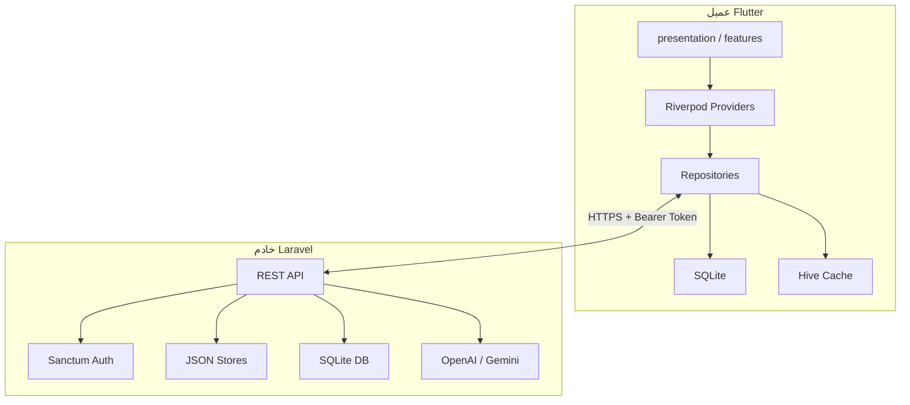
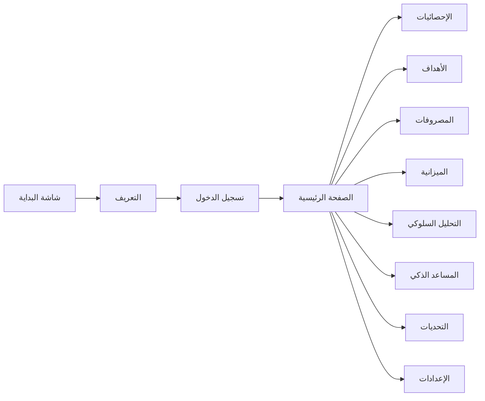

# تقرير مشروع Mudabbir (مُدَبِّر)

> **الإصدار:** 1.0.0+1  
> **التاريخ:** يوليو 2026  
> **النوع:** تطبيق إدارة مالية شخصية ثنائي اللغة (عربي / إنجليزي)  
> **الهيكل:** Monorepo — Flutter (عميل) + Laravel (خادم API)

---

## جدول المحتويات

1. [نظرة عامة](#1-نظرة-عامة)
2. [هيكل المستودع](#2-هيكل-المستودع)
3. [الميزات الرئيسية](#3-الميزات-الرئيسية)
4. [التقنيات المستخدمة](#4-التقنيات-المستخدمة)
5. [الواجهة الأمامية (Flutter)](#5-الواجهة-الأمامية-flutter)
6. [الخادم الخلفي (Laravel)](#6-الخادم-الخلفي-laravel)
7. [واجهة برمجة التطبيقات (API)](#7-واجهة-برمجة-التطبيقات-api)
8. [قاعدة البيانات والتخزين](#8-قاعدة-البيانات-والتخزين)
9. [الذكاء الاصطناعي](#9-الذكاء-الاصطناعي)
10. [المزامنة دون اتصال (Offline-First)](#10-المزامنة-دون-اتصال-offline-first)
11. [الأمان والمصادقة](#11-الأمان-والمصادقة)
12. [الاختبارات](#12-الاختبارات)
13. [النشر والإنتاج](#13-النشر-والإنتاج)
14. [التصميم وتجربة المستخدم](#14-التصميم-وتجربة-المستخدم)
15. [السكربتات والأدوات](#15-السكربتات-والأدوات)
16. [الوثائق المتوفرة](#16-الوثائق-المتوفرة)
17. [الفجوات والتحسينات المستقبلية](#17-الفجوات-والتحسينات-المستقبلية)

---

## 1. نظرة عامة

**Mudabbir** (مُدَبِّر) تطبيق مالي شخصي يستهدف المتحدثين بالعربية والإنجليزية. يمكّن المستخدم من:

- تتبع الدخل والمصروفات
- إدارة الميزانية الشهرية مع تنبيهات
- تحديد أهداف ادخار ومتابعة تقدمها ومعالمها
- تحليل السلوك المالي والحصول على درجة صحة مالية
- المشاركة في تحديات ادخار اجتماعية متزامنة مع الخادم
- التحدث مع مساعد مالي ذكي (AI) مع بث فوري (SSE)
- تصدير تقارير شهرية بصيغة PDF قابلة للمشاركة

التطبيق مبني بفلسفة **Offline-First**: يعمل محلياً عبر SQLite و Hive، ويتزامن مع الخادم عند توفر الاتصال.

| البند | التفاصيل |
|-------|----------|
| **العلامة التجارية** | Navy `#112E81` / `#102A5C` |
| **الخط الأساسي** | Eight (عربي/لاتيني) + IBM Plex Sans Arabic (احتياطي) |
| **خط العملة** | Saudi Riyal (رمز ﷼) |
| **العملة** | ريال سعودي (SAR) |
| **الاتجاه** | RTL للعربية، LTR للإنجليزية |
| **المنصات** | Android، iOS، Windows، macOS، Web |
| **نوع المشروع** | مشروع تخرج / محفظة أعمال |

### مخطط معماري عام



---

## 2. هيكل المستودع

```
Mudabbir.app-main/
├── frontend/                  # تطبيق Flutter
│   ├── lib/
│   │   ├── core/              # الثيم، التوجيه، ودجات مشتركة
│   │   ├── features/          # وحدات الميزات (auth, home, goals, …)
│   │   ├── presentation/      # الشاشات والـ ViewModels
│   │   ├── domain/            # النماذج، المستودعات، محركات الأعمال
│   │   ├── data/              # SQLite، Hive، Dio، خدمات API
│   │   ├── service/           # DI، GoRouter، الإشعارات، التقارير
│   │   ├── constants/         # الثيم، الألوان، مفاتيح Hive
│   │   ├── l10n/              # app_ar.arb، app_en.arb
│   │   └── utils/             # devLog، مساعدات الجلسة
│   ├── android/               # إعدادات Android + توقيع
│   ├── ios/                   # إعدادات iOS
│   ├── test/                  # اختبارات الوحدة والواجهة (22 ملف)
│   ├── integration_test/      # اختبارات التكامل (auth flow)
│   ├── assets/                # خطوط، أيقونات، صور تسويقية
│   └── config/                # release.json (عنوان API للإنتاج)
├── backend/                   # API Laravel
│   ├── app/
│   │   ├── Http/Controllers/Api/
│   │   ├── Http/Middleware/
│   │   ├── Http/Requests/
│   │   ├── Http/Resources/
│   │   ├── Models/
│   │   ├── Services/
│   │   ├── Jobs/
│   │   └── Support/
│   ├── routes/api.php
│   ├── database/migrations/
│   ├── tests/Feature/         # 16 ملف اختبار
│   └── docker/render-start.sh
├── docs/                      # أدلة النشر والمتجر والتقارير
├── scripts/                   # سكربتات PowerShell للبناء والتشغيل
├── screenshots/               # لقطات شاشة للمتجر و README
├── render.yaml                # إعداد نشر Render
└── README.md
```

---

## 3. الميزات الرئيسية

| الميزة | الوصف | العميل | الخادم |
|--------|-------|--------|--------|
| **الرئيسية (Home)** | الرصيد، شريط الميزانية، إجراءات سريعة، لمحة عن الأهداف | ✅ | ✅ Dashboard |
| **المصروفات والدخل** | إضافة، تعديل، حذف، فلترة، تكرار | ✅ SQLite + مزامنة | ✅ JSON + DB |
| **الميزانية** | حدود شهرية، تنبيهات 80% وتجاوز | ✅ | ✅ |
| **الأهداف** | أهداف ادخار، مساهمات، معالم (milestones) | ✅ | ✅ |
| **الإحصائيات** | مؤشرات KPI، رسوم بيانية، رؤى نصية | ✅ fl_chart | ✅ (cache 5 دقائق) |
| **لوحة التحكم** | درجة الصحة، KPIs، اتجاه شهري، توزيع المصروفات | ✅ (محلي) | ✅ `/dashboard` |
| **التحليل السلوكي** | درجة الصحة المالية، رؤى الادخار والفئات | ✅ (محرك محلي) | جزئي عبر Dashboard |
| **التحديات** | إنشاء، دعوة، لوحة متصدرين، قوالب جاهزة | ✅ | ✅ |
| **المساعد الذكي** | محادثة مالية ثنائية اللغة مع بث SSE | ✅ | ✅ OpenAI / Gemini |
| **التقارير** | PDF شهري قابل للمشاركة (RTL، خط Eight) | ✅ | ✅ |
| **الإشعارات** | محلية + FCM (هيكل جاهز) | ✅ | ✅ |
| **المصادقة** | تسجيل، دخول، خروج، تدوير التوكن | ✅ | ✅ Sanctum |
| **الثيمات** | فاتح / داكن | ✅ | — |
| **الترجمة** | عربي / إنجليزي | ✅ ARB | رسائل خطأ عربية |

### تدفق المستخدم



---

## 4. التقنيات المستخدمة

### الواجهة الأمامية

| التقنية | الإصدار | الاستخدام |
|---------|---------|-----------|
| Flutter / Dart | SDK ^3.8.1 | إطار التطبيق |
| flutter_riverpod | ^2.6.1 | إدارة حالة الواجهة |
| get_it | ^8.2.0 | حقن التبعيات (DI) |
| go_router | ^16.2.1 | التوجيه والتنقل |
| dio | ^5.9.0 | طلبات HTTP |
| sqflite | ^2.4.2 | قاعدة بيانات محلية |
| hive / hive_flutter | ^2.2.3 | تخزين مؤقت سريع |
| flutter_secure_storage | ^9.2.4 | تخزين التوكن بأمان |
| fl_chart | ^0.68.0 | الرسوم البيانية |
| pdf / printing | ^3.12.0 / ^5.14.2 | تصدير PDF |
| dartz | ^0.10.1 | Either / معالجة الأخطاء |
| intl | ^0.20.2 | تنسيق التواريخ والعملات |
| flutter_local_notifications | ^18.0.1 | إشعارات محلية |
| permission_handler | ^11.4.0 | أذونات الإشعارات |
| flutter_svg | ^2.0.17 | أيقونات SVG |
| share_plus | ^7.0.1 | مشاركة التقارير |

### الخادم الخلفي

| التقنية | الإصدار | الاستخدام |
|---------|---------|-----------|
| PHP | ^8.0.2 (Docker: 8.2) | لغة الخادم |
| Laravel | ^9.19 | إطار API |
| Laravel Sanctum | ^3.0 | مصادقة Bearer Token |
| Guzzle | ^7.2 | طلبات HTTP للـ AI |
| SQLite | — | قاعدة بيانات الإنتاج |
| PHPUnit | ^9.5 | الاختبارات |

---

## 5. الواجهة الأمامية (Flutter)

### 5.1 هيكل الطبقات

```
lib/
├── core/                 # طبقة أساسية مشتركة
│   ├── theme/            # AppTheme، AppColors، ThemeProvider
│   ├── router/           # GoRouter، AppRoutes، AppScreens
│   ├── widgets/          # AppButton، AppChip، TransactionTile، …
│   └── providers/        # AppProviders
├── features/             # وحدات ميزات (feature-first)
│   ├── auth/             # تسجيل الدخول والتسجيل
│   ├── splash/           # شاشة البداية
│   ├── onboarding/       # التعريف بالتطبيق
│   ├── home/             # الصفحة الرئيسية
│   ├── goals/            # الأهداف
│   ├── budget/           # الميزانية
│   ├── transactions/     # المعاملات
│   ├── analysis/         # التحليل السلوكي
│   ├── ai_assistant/     # المساعد الذكي
│   ├── challenges/       # التحديات
│   └── settings/         # الإعدادات
├── presentation/         # الشاشات، الودجات، ViewModels
├── domain/               # النماذج، المستودعات، محركات الأعمال
├── data/                 # SQLite، Hive، Dio، خدمات API
├── service/              # DI، التوجيه، الإشعارات، التقارير
├── constants/            # الثيم، الألوان، مفاتيح Hive
├── l10n/                 # الترجمة (ARB)
└── utils/                # devLog، مساعدات
```

### 5.2 الشاشات والتنقل

**الهيكل الرئيسي:** `HomePage` — شريط سفلي بثلاث تبويبات (الرئيسية · الإحصائيات · الأهداف)، زر إعدادات في الشريط العلوي، وزر عائم للمساعد الذكي.

**مسارات GoRouter (`AppRoutes`):**

| المسار | الشاشة |
|--------|--------|
| `/splash` | شاشة البداية |
| `/onboarding` | التعريف بالتطبيق |
| `/login` | تسجيل الدخول |
| `/signup` | إنشاء حساب |
| `/home` | الصفحة الرئيسية |
| `/expenses` | المصروفات |
| `/budget` | الميزانية |
| `/analysis` | التحليل السلوكي |
| `/analysis/financial-health` | تقرير الصحة المالية |
| `/chatbot` | المساعد الذكي |
| `/challenges` | التحديات |
| `/challenges/create` | إنشاء تحدٍ |
| `/challenges/invitations` | الدعوات المعلّقة |
| `/challenges/:id` | تفاصيل تحدٍ |
| `/goals` | الأهداف |
| `/goals/:id` | تفاصيل هدف |
| `/settings` | الإعدادات |
| `/notifications` | الإشعارات |
| `/privacy` | سياسة الخصوصية |
| `/terms` | شروط الاستخدام |
| `/invite` | دعوة للتحديات |
| `/landing` | صفحة هبوط (Web) |

**منطق إعادة التوجيه:** `AuthNotifier` + علامة onboarding في Hive. وضع الضيف (Guest) متاح في وضع التطوير فقط عبر `InstantBrowseBootstrap`.

### 5.3 إدارة الحالة

| الأداة | الاستخدام |
|--------|-----------|
| **Riverpod** | `StateNotifierProvider` للصفحة الرئيسية، الإحصائيات، الأهداف، الميزانية، المصروفات، التحليل، المحادثة، التحديات |
| **GetIt** | Singletons: المستودعات، الخدمات، التخزين المؤقت، `AuthNotifier` |
| **ChangeNotifier** | `AuthNotifier` (يُحدّث GoRouter)، `ThemeNotifier`، `AppLanguageController` |

### 5.4 خدمات API

| الخدمة | النقاط المرتبطة |
|--------|-----------------|
| `ApiService` / `UserRepository` | `/register`, `/login`, `/logout` |
| `ExpenseApiService` | `/expenses` CRUD |
| `BudgetApiService` | `/budgets` CRUD |
| `GoalApiService` | `/goals` CRUD + مساهمات ومعالم |
| `ChallengeService` | `/challenges/*` |
| `NotificationApiService` | `/notifications` |
| `ChatbotApiClient` / `ChatSseService` | `/ai/chat` (SSE) |
| `DioClient` | عنوان أساسي، Bearer auth، تسجيل خروج تلقائي عند 401 |

**عنوان API:**

| البيئة | العنوان |
|--------|---------|
| **Debug (محاكي Android)** | `http://10.0.2.2:8000` |
| **Debug (سطح المكتب)** | `http://127.0.0.1:8000` |
| **Release** | `https://mudabbir-backend-api.onrender.com` (عبر `config/release.json`) |

**أعلام التطوير (dart-define):**

| العلم | الوظيفة |
|-------|---------|
| `DISABLE_INSTANT_BROWSE=true` | تعطيل وضع الضيف والبيانات التجريبية |
| `FORCE_PROD_API=true` | إجبار استخدام API الإنتاج في التطوير |

### 5.5 التخزين المحلي

**SQLite** (`LocalDatabase`، إصدار المخطط **8**، ملف لكل مستخدم):

| الجدول | الغرض |
|--------|-------|
| `accounts` | الحسابات المالية |
| `categories` | فئات المصروفات |
| `transactions` | الدخل والمصروفات |
| `goals` | أهداف الادخار |
| `goal_contributions` | مساهمات الأهداف |
| `challenges` | التحديات المحلية |
| `budgets` | الميزانيات |
| `chat_messages` | سجل المحادثة |
| جداول audit | تدقيق العمليات |

**Hive:**

| الصندوق | الغرض |
|---------|-------|
| `ExpenseHiveCache` | تخزين مؤقت للمصروفات |
| `BudgetHiveCache` | تخزين مؤقت للميزانيات |
| `GoalHiveCache` | تخزين مؤقت للأهداف |
| `ChallengeHiveCache` | تخزين مؤقت للتحديات |
| `prefs` / `myBox` | تفضيلات، onboarding، معلومات المستخدم |

**تخزين آمن:**

- `AuthTokenSecureStore` — توكن Sanctum (Keychain / Keystore)

### 5.6 المستودعات الرئيسية

| المستودع | الوظيفة |
|----------|---------|
| `SyncedExpenseRepository` | مصروفات مع مزامنة ثنائية الاتجاه |
| `SyncedBudgetRepository` | ميزانيات مع مزامنة |
| `SyncedGoalsRepository` | أهداف مع مزامنة |
| `ExpenseRepository` | وصول محلي للمصروفات |
| `BudgetRepository` | وصول محلي للميزانيات |
| `GoalsRepository` | وصول محلي للأهداف |
| `HomeRepository` | بيانات الصفحة الرئيسية |
| `BehavioralAnalysisRepository` | تحليل سلوكي محلي |
| `ServerChallengeRepository` | تحديات من الخادم |
| `UserRepository` | المصادقة والجلسة |

### 5.7 محركات الأعمال المحلية

| المحرك | الوظيفة |
|--------|---------|
| `GoalProgressEngine` | حساب تقدم الأهداف |
| `BehavioralAnalysisEngine` | درجة الصحة المالية ورؤى السلوك |
| `HealthScoreCalculator` | حساب درجة الصحة |
| `ChatbotLocalFallback` | ردود محلية عند انقطاع AI |
| `FinancialAlertService` | تنبيهات الميزانية وإكمال الأهداف |

---

## 6. الخادم الخلفي (Laravel)

### 6.1 المتحكمات (`app/Http/Controllers/Api/`)

| المتحكم | المسؤولية |
|---------|-----------|
| `AuthController` | تسجيل، دخول، خروج |
| `HealthController` | فحص صحة الخدمة |
| `ExpenseController` | CRUD المصروفات + فلترة |
| `BudgetController` | CRUD الميزانيات |
| `GoalController` | الأهداف، المساهمات، المعالم |
| `ChallengeController` | التحديات الاجتماعية |
| `StatisticsController` | إحصائيات مجمّعة (cache 5 دقائق) |
| `DashboardController` | لوحة تحكم موحّدة (صحة + KPIs + اتجاه) |
| `ReportController` | تقرير شهري (cache 30 دقيقة) |
| `NotificationController` | إشعارات داخل التطبيق |
| `AiChatController` | محادثة AI مع بث SSE |
| `GenerateContentController` | توليد محتوى AI |

### 6.2 الخدمات (`app/Services/`)

| الخدمة | الدور |
|--------|-------|
| `AuthService` | منطق التسجيل والدخول |
| `ExpenseStore`, `BudgetStore`, `GoalStore`, `ChallengeStore` | تخزين JSON في `storage/app/` |
| `ExpenseDatabaseSync` | مزامنة JSON → جدول SQLite `expenses` |
| `StatisticsService` | إحصائيات مجمّعة |
| `DashboardService` | لوحة تحكم موحّدة (صحة + KPIs + سلوك) |
| `DashboardCache` | تخزين مؤقت للوحة التحكم |
| `ReportService` | تقارير شهرية |
| `UserFinancialContextService` | بناء سياق مالي لـ AI |
| `OpenAiStreamService`, `OpenAiService`, `GeminiService` | مزوّدو AI |
| `FcmService` | إشعارات Firebase |
| `HealthCheckService` | فحص DB + إعدادات AI |

### 6.3 نمط التخزين الهجين

| البيانات | التخزين الأساسي | ملاحظات |
|----------|-----------------|----------|
| المصروفات | JSON + SQLite | JSON مصدر الحقيقة، DB للفلترة والفهرسة |
| الميزانيات | JSON فقط | — |
| الأهداف | JSON فقط | — |
| التحديات | JSON فقط | — |
| المستخدمون | SQLite (Eloquent) | — |
| الإشعارات | SQLite | — |
| توكنات الأجهزة | SQLite | FCM |

### 6.4 المهام المجدولة

- `CheckBudgetLimitsJob` — فحص حدود الميزانية يومياً الساعة 08:00

### 6.5 تحديد معدل الطلبات (Rate Limiting)

| المحدّد | الحد | الاستخدام |
|---------|------|-----------|
| `api` | 100/دقيقة | الطلبات العامة |
| `auth-login` | 5/دقيقة | تسجيل الدخول |
| `auth-register` | 5/دقيقة | التسجيل |
| `ai` | 20/دقيقة | طلبات AI |
| `challenges-write` | 30/دقيقة | كتابة التحديات |

### 6.6 نمط الاستجابة الموحّد

جميع الاستجابات تمر عبر `ApiResponse` trait/helper:

```json
{
  "success": true,
  "message": "رسالة بالعربية",
  "data": { ... }
}
```

يدعم: `success`, `created`, `error`, `conflict` (409), `paginated`, `codedError`.

---

## 7. واجهة برمجة التطبيقات (API)

**الأساس:** `/api` — المسارات المحمية تتطلب `Authorization: Bearer <token>`.

### عامة (بدون مصادقة)

| Method | Path | الوصف |
|--------|------|-------|
| GET | `/health` | فحص صحة الخدمة |
| POST | `/register` | تسجيل مستخدم جديد |
| POST | `/login` | تسجيل الدخول |

### محمية (`auth:sanctum`)

| Method | Path | الوصف |
|--------|------|-------|
| POST | `/logout` | إلغاء التوكن |
| POST | `/ai/chat` | محادثة AI (SSE أو JSON) |
| POST | `/generate-content` | توليد محتوى AI |
| GET | `/statistics` | إحصائيات المستخدم |
| GET | `/dashboard` | لوحة تحكم موحّدة |
| GET | `/reports/monthly` | تقرير شهري (`?month=YYYY-MM`) |
| GET | `/notifications` | قائمة الإشعارات |
| PATCH | `/notifications/{id}/read` | تعليم كمقروء |
| CRUD | `/expenses`, `/expenses/{id}` | المصروفات |
| CRUD | `/budgets`, `/budgets/{id}` | الميزانيات |
| CRUD | `/goals`, `/goals/{id}` | الأهداف |
| POST | `/goals/{id}/contributions` | إضافة مساهمة |
| POST | `/goals/{id}/milestones` | إضافة معلم |
| GET | `/challenges` | قائمة التحديات |
| GET | `/challenges/{id}` | تفاصيل تحدٍ |
| GET | `/challenges/templates` | قوالب جاهزة |
| GET | `/challenges/invitations/pending` | دعوات معلّقة |
| GET | `/challenges/{id}/leaderboard` | لوحة المتصدرين |
| POST | `/challenges` | إنشاء تحدٍ |
| POST | `/challenges/from-template` | إنشاء من قالب |
| PUT | `/challenges/{id}` | تحديث |
| DELETE | `/challenges/{id}` | حذف |
| POST | `/challenges/{id}/progress` | تسجيل تقدم |
| POST | `/challenges/{id}/check-in` | تسجيل حضور |
| POST | `/challenges/{id}/invite` | دعوة مستخدم |
| POST | `/challenges/{id}/respond` | قبول / رفض دعوة |
| PATCH | `/challenges/{id}/status` | تبديل الحالة |
| DELETE | `/challenges/{id}/participants/{userId}` | إزالة مشارك |

**فلترة المصروفات:** `from`, `to`, `category`, `min`, `max`, `sort` (date|amount), `per_page`.

**استجابة Dashboard (مثال):**

```json
{
  "success": true,
  "data": {
    "health_score": 72,
    "health_grade": "good",
    "kpis": {
      "total_income": 15000,
      "total_expenses": 9500,
      "net_savings": 5500,
      "savings_rate": 36.7
    },
    "monthly_trend": [...],
    "expense_distribution": [...],
    "behavior_analysis": {...}
  }
}
```

---

## 8. قاعدة البيانات والتخزين

### 8.1 Laravel (SQLite في الإنتاج)

| الجدول | الأعمدة الرئيسية |
|--------|------------------|
| `users` | id, name, email, password, timestamps |
| `personal_access_tokens` | Sanctum tokens |
| `expenses` | id (client-assigned), user_id, amount, date, type, notes, category_id, is_recurring, synced_at |
| `user_notifications` | user_id, type, title, body, data (json), read_at |
| `device_tokens` | user_id, fcm_token, platform |

**فهارس `expenses`:** `(user_id, date)`, `(user_id, category_id)`, `(user_id, amount)`

### 8.2 ملفات JSON (غير migrations)

- `storage/app/expenses.json`
- `storage/app/budgets.json`
- `storage/app/goals.json`
- `storage/app/challenges.json`

### 8.3 Flutter SQLite (محلي فقط)

مخطط إصدار **8** — جداول: accounts, categories, transactions, goals, goal_contributions, challenges, budgets, chat_messages, audit.

كل مستخدم يحصل على ملف DB منفصل: `{user_email}_finance.db`

---

## 9. الذكاء الاصطناعي

| البند | التفاصيل |
|-------|----------|
| **المزوّدون** | OpenAI (`gpt-4o-mini`) أو Google Gemini (`gemini-2.0-flash`) |
| **الإعداد** | متغير `AI_PROVIDER` في `.env` (`openai` \| `gemini`) |
| **المحادثة** | `POST /api/ai/chat` — بث SSE أو JSON |
| **السياق** | `UserFinancialContextService` يبني ملخصاً مالياً من بيانات المستخدم |
| **العميل** | `ChatSseService` للبث، `ChatbotLocalFallback` عند انقطاع الاتصال |
| **الحد** | 20 طلب/دقيقة (throttle:ai) |

**متغيرات البيئة للـ AI:**

```env
AI_PROVIDER=openai
OPENAI_API_KEY=sk-...
OPENAI_MODEL=gpt-4o-mini
GEMINI_API_KEY=...
GEMINI_MODEL=gemini-2.0-flash
```

---

## 10. المزامنة دون اتصال (Offline-First)

```
┌─────────────┐     ┌──────────┐     ┌─────────────┐
│  UI Layer   │────▶│  Hive    │────▶│  SQLite     │
│ (Riverpod)  │     │  Cache   │     │  (primary)  │
└─────────────┘     └──────────┘     └──────┬──────┘
                                            │
                                      عند الاتصال
                                            ▼
                                     ┌─────────────┐
                                     │ Laravel API │
                                     │  (JSON+DB)  │
                                     └─────────────┘
```

**المستودعات المتزامنة:**

- `SyncedExpenseRepository`
- `SyncedBudgetRepository`
- `SyncedGoalsRepository`

**آليات:**

- معرّفات يُنشئها العميل (client-assigned IDs) للمصروفات
- كشف تعارض optimistic concurrency (409 Conflict)
- تفريغ العمليات المعلّقة (pending-op flush) عند عودة الاتصال
- Hive كاحتياطي عند فشل الشبكة
- `SyncFlushLock` لمنع تزامن متزامن

---

## 11. الأمان والمصادقة

| الآلية | التفاصيل |
|--------|----------|
| **المصادقة** | Laravel Sanctum — Bearer Token |
| **تخزين التوكن** | `flutter_secure_storage` (Keychain / Keystore) |
| **مدة التوكن** | 43200 دقيقة (30 يوم) — `SANCTUM_TOKEN_EXPIRATION` |
| **تدوير التوكن** | عند كل تسجيل دخول |
| **401** | اعتراض Dio → تسجيل خروج تلقائي |
| **CORS** | Middleware مخصص + `config/cors.php` |
| **Rate limiting** | على المصادقة و AI والتحديات |
| **عزل البيانات** | كل مستخدم يرى بياناته فقط (مُختبر) |
| **وضع الضيف** | معطّل في الإنتاج |
| **التسجيل** | `devLog` صامت في release، لا تسجيل Dio |

---

## 12. الاختبارات

### 12.1 الخادم — PHPUnit (16 ملف Feature)

| الملف | المجال |
|-------|--------|
| `AuthApiTest` | التحقق، تدوير التوكن، القفل |
| `HealthApiTest` | الصحة العامة، AI معطّل، فشل DB |
| `ExpensesApiTest` | CRUD، المصادقة |
| `ExpensesFilterApiTest` | الفلاتر، تنسيق المبالغ |
| `ExpenseConflictApiTest` | تعارض 409 |
| `BudgetsApiTest` | CRUD |
| `GoalsApiTest` | CRUD + مساهمات |
| `GoalsMilestonesApiTest` | إنجاز المعالم |
| `ChallengesApiTest` | قوالب، دعوات، لوحة متصدرين |
| `StatisticsApiTest` | الغلاف، cache، مصادقة |
| `DashboardApiTest` | لوحة التحكم |
| `ReportApiTest` | تقرير شهري |
| `GenerateContentTest` | AI، تجاوز الحصة |
| `RateLimitingTest` | 429 |
| `ApiExceptionHandlerTest` | رسائل عربية (401/404/validation) |
| `UserDataIsolationTest` | عزل بيانات المستخدم |

### 12.2 العميل — Flutter (22 ملف اختبار + تكامل)

| الفئة | الاختبارات |
|-------|------------|
| **وحدة** | health_score، behavioral_analysis، goal_progress، sync_policies، expense_transaction، chatbot (parser, insights, fallback, api, context)، financial_alert، auth_validators، demo_seed، localizations |
| **واجهة** | home_screen، chatbot_screen، widget_test |
| **تكامل** | `auth_flow_test` (تسجيل/دخول) |

**تشغيل الاختبارات:**

```bash
# الخادم
cd backend && php artisan test

# العميل
cd frontend && flutter test
cd frontend && flutter analyze
```

### 12.3 فجوات الاختبار

- لا اختبارات لـ `AiChatController`، الإشعارات، FCM في الخادم
- تكامل محدود للمزامنة دون اتصال
- لا اختبارات E2E شاملة لجميع الشاشات

---

## 13. النشر والإنتاج

### 13.1 Render (الخادم)

| البند | القيمة |
|-------|--------|
| **الخدمة** | `mudabbir-backend-api` |
| **الرابط** | `https://mudabbir-backend-api.onrender.com` |
| **Runtime** | Docker (`backend/Dockerfile`) |
| **الخطة** | Free |
| **فحص الصحة** | `GET /api/health` |
| **قاعدة البيانات** | SQLite |
| **أسرار مطلوبة** | `APP_KEY`, `OPENAI_API_KEY` أو `GEMINI_API_KEY` |

**تسلسل الإقلاع** (`docker/render-start.sh`):

1. التحقق من `APP_KEY`
2. إنشاء ملف SQLite ومجلدات التخزين
3. `migrate --force` + `config:cache` + `route:cache`
4. `php artisan serve` على المنفذ `$PORT`

### 13.2 Flutter (العميل)

```bash
# بناء APK للإنتاج
flutter build apk --release --dart-define-from-file=config/release.json

# بناء AAB لمتجر Play
scripts/build-release-aab.ps1
```

- توقيع Android عبر `frontend/android/key.properties`
- إصدار التطبيق: `1.0.0+1`

### 13.3 Docker محلي

```bash
cd backend
docker-compose up   # المنفذ 8000
```

### 13.4 بدء التطوير السريع

```bash
# تشغيل الخادم
powershell -ExecutionPolicy Bypass -File scripts/start-backend.ps1

# تشغيل التطبيق
cd frontend && flutter pub get && flutter run
```

---

## 14. التصميم وتجربة المستخدم

| العنصر | التفاصيل |
|--------|----------|
| **اللون الأساسي** | Navy `#112E81` / `#102A5C` |
| **الخط** | Eight (أساسي)، IBM Plex Sans Arabic (احتياطي) |
| **خط العملة** | Saudi Riyal |
| **الثيم** | فاتح / داكن عبر `ThemeNotifier` |
| **المكوّنات** | `AppCard`, `IOSEmptyState`, `ModernGradientAppBar`, `AppSectionHeader`, `TransactionTile` |
| **التصميم** | مستوحى من iOS — بطاقات، زوايا دائرية، ظلال خفيفة |
| **RTL** | `Directionality` في `main.dart` |
| **العملة** | تنسيق SAR عربي عبر `ArabicCurrencyFormatter` / `SaudiRiyalFont` |
| **PDF** | Eight، RTL، رمز ﷼ |
| **الأيقونة** | `wallet_mark_white.png` على خلفية `#102A5C` |

### رموز التصميم (Design Tokens)

| الملف | المحتوى |
|-------|---------|
| `constants/app_colors.dart` | ألوان العلامة |
| `constants/app_spacing.dart` | مسافات موحّدة |
| `constants/app_radius.dart` | زوايا دائرية |
| `constants/app_shadows.dart` | ظلال البطاقات |
| `constants/app_typography.dart` | أنماط النصوص |
| `constants/app_gradients.dart` | تدرجات الشريط العلوي |

---

## 15. السكربتات والأدوات

| السكربت | الوظيفة |
|---------|---------|
| `scripts/start-backend.ps1` | تشغيل Laravel محلياً |
| `scripts/build-release-aab.ps1` | بناء AAB للمتجر |
| `scripts/build-release-apk.ps1` | بناء APK للتثبيت المباشر |
| `scripts/check-production-api.ps1` | التحقق من API الإنتاج |
| `scripts/generate-app-key.ps1` | توليد `APP_KEY` |
| `scripts/laravel-cloud-redeploy.ps1` | إعادة نشر Laravel Cloud |

---

## 16. الوثائق المتوفرة

| الملف | المحتوى |
|-------|---------|
| `README.md` | نظرة عامة، بدء سريع، قائمة إصدار |
| `docs/PROJECT_REPORT.md` | هذا التقرير |
| `docs/DEPLOY_RENDER_AR.md` | نشر على Render (موصى به) |
| `docs/DEPLOY_RENDER.md` | نشر Render (إنجليزي) |
| `docs/DEPLOY_LARAVEL_CLOUD.md` | بديل Laravel Cloud |
| `docs/PLAY_STORE.md` | إعداد متجر Google Play |
| `docs/PRODUCTION_API.md` | إعداد API الإنتاج |
| `docs/GOALS_CHALLENGES_REVIEW.md` | مراجعة الأهداف والتحديات |
| `docs/CLEANUP_REPORT.md` | تقرير تنظيف الكود |
| `docs/render-env.example` | مثال متغيرات البيئة |

---

## 17. الفجوات والتحسينات المستقبلية

| المجال | الوضع الحالي | اقتراح |
|--------|-------------|--------|
| **قاعدة البيانات** | SQLite + JSON | الانتقال لـ PostgreSQL عند التوسع |
| **اختبارات AI** | غير مغطاة | إضافة اختبارات mock لـ AiChatController |
| **FCM** | هيكل جاهز | تفعيل كامل للإشعارات الفورية |
| **E2E** | auth فقط | توسيع اختبارات التكامل |
| **iOS** | مدعوم | اختبار ونشر App Store |
| **Web** | مدعوم | تحسين تجربة الويب |
| **API 36** | محاكي Android 16 | قد يحتاج مسح بيانات المحاكي عند مشاكل تشغيل |

---

## ملخص تنفيذي

**Mudabbir** مشروع تخرج / محفظة أعمال متكامل يجمع بين:

- عميل Flutter حديث (Offline-First، ثنائي اللغة، RTL)
- خادم Laravel REST API مع مصادقة Sanctum
- ذكاء اصطناعي مالي سياقي (OpenAI / Gemini)
- تحديات اجتماعية ومزامنة بيانات
- لوحة تحكم موحّدة (`/dashboard`) مع درجة الصحة المالية
- نشر جاهز على Render مع وثائق عربية شاملة
- تغطية اختبارية جيدة: **16** ملف Feature في الخادم و **22+** اختبار في العميل

المشروع جاهز للعرض والنشر التجريبي، مع مسار واضح للتحسينات المستقبلية.

---

*تم إعداد هذا التقرير بناءً على حالة المستودع في يوليو 2026.*
